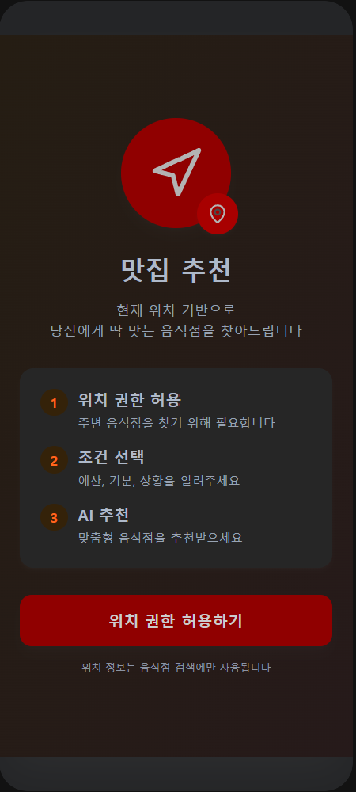
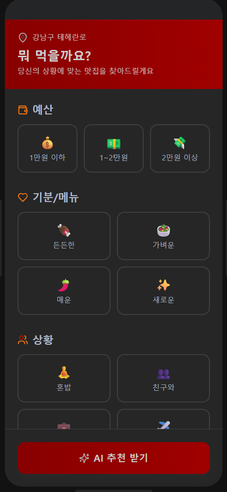
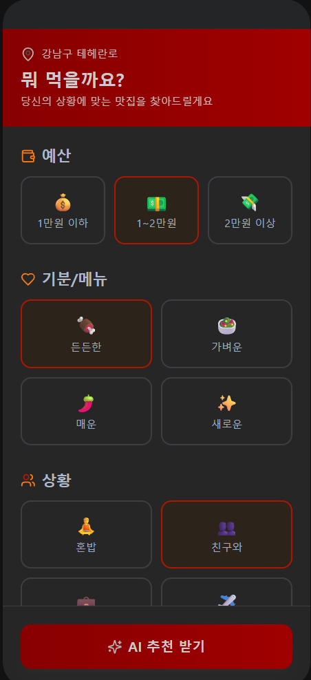
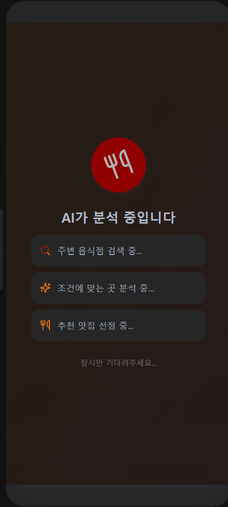
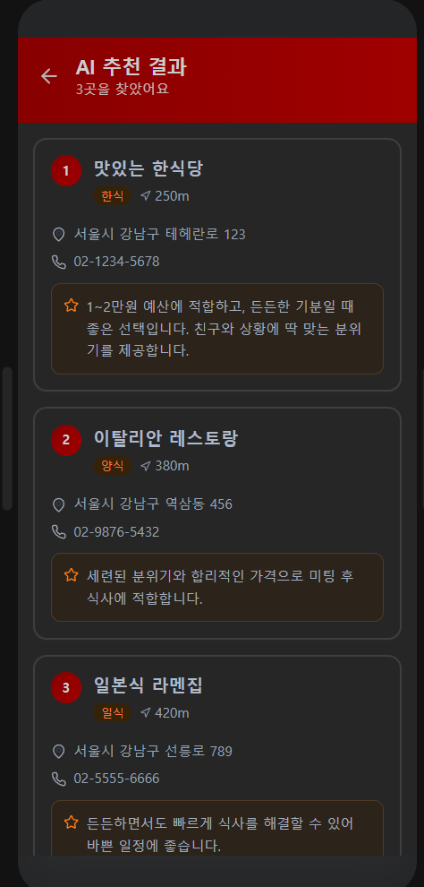
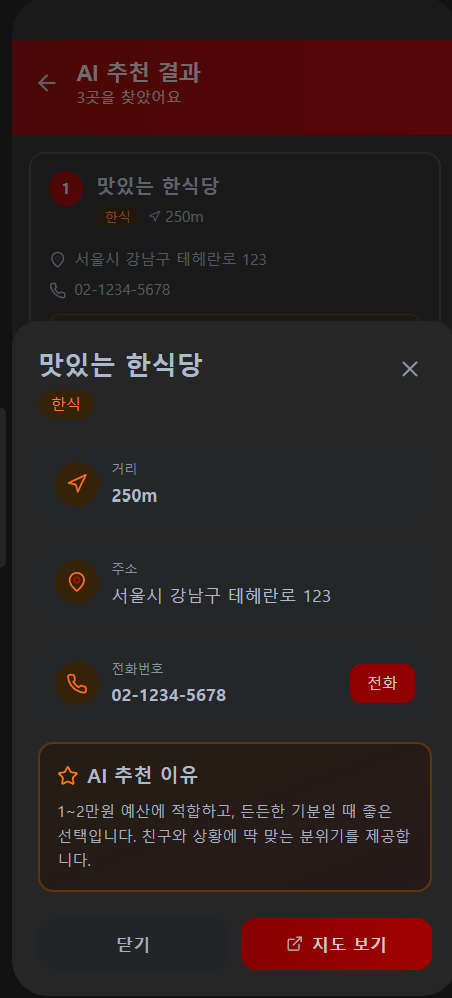

# 🍽️ AI 맛집 추천 서비스 - Eating (mobile_programing)

> **과목**: 모바일프로그래밍  
> **개발자**: 김건희 (학번: 20211903)  
> **버전**: eating_v3  
> **대상 플랫폼**: Android API 26 (Android 8.0 Oreo) 이상  

---

## 📌 1. 프로젝트 개요

낯선 장소(여행지, 출장지, 파견 등)에서 식사할 곳을 고를 때 **"뭘 먹을지 고민되는 상황"**이나 **"결정 장애"**를 겪는 사용자를 위한 모바일 애플리케이션입니다. 

사용자의 **현재 실시간 GPS 위치**를 기반으로 반경 2km 이내의 음식점을 검색하고, 사용자의 **인원 수, 예산, 기분, 식사 상황** 정보를 입력받아 **Google Gemini AI**가 최적의 맛집 최대 3개를 엄선하여 그 구체적인 추천 이유와 함께 제안합니다.

### 🎯 주요 타겟 사용자
* 처음 가본 여행지나 출장지에서 빠르게 식사해야 하는 사용자
* 회사 미팅, 세미나, 동창회 등 특정 예산과 상황에 맞는 식당을 찾아야 하는 모임 주최자
* 주변 식당 정보는 많지만, 오늘 내 기분과 날씨에 딱 맞는 숨은 맛집을 골라보고 싶은 사용자

---

## 🎨 2. 주요 실행 화면 (Screenshots)

| 메인 화면 | 조건 선택 | 커스텀 직접 입력 |
| :---: | :---: | :---: |
|  |  |  |

| AI 분석 중 | AI 추천 결과 | 식당 상세 정보 |
| :---: | :---: | :---: |
|  |  |  |

---

## ✨ 3. 핵심 기능 및 특징

### 1️⃣ 실시간 위치 기반 주변 검색 (FR-01, FR-02)
* `FusedLocationProviderClient`를 사용해 사용자의 **실시간 GPS 경위도 좌표**를 정확하게 가져옵니다.
* 카카오 Local API를 통해 검색된 반경 2km 이내의 실제 음식점 정보를 거리순으로 실시간 파싱합니다.
* 중복 음식점(프랜차이즈 및 분점 중복 등)은 ID 및 정규화 명칭을 대조해 자동 필터링합니다.

### 2️⃣ 기분/예산/상황 맞춤형 조건 선택 (FR-03, FR-04)
* 인원, 예산, 기분(맛), 상황 등을 직관적인 Chip UI로 빠르게 클릭하여 선택할 수 있습니다.
* **직접 입력(✏️) 커스텀 기능**: 제공된 칩 프리셋 외에 사용자가 직접 텍스트("12명", "삼겹살", "졸업 파티" 등)를 입력할 수 있도록 전용 커스텀 입력 다이얼로그를 지원하여 추천의 유연성을 강화했습니다.

### 3️⃣ Google Gemini AI 연동 개인화 추천 (FR-04, FR-05)
* 카카오 Local API 검색 결과와 사용자 선택 조건을 프롬프트로 가공하여 최신 **gemini-2.5-flash** 모델에 실시간으로 전달합니다.
* LLM의 환각(Hallucination) 현상을 극복하기 위해 **강력한 프롬프트 제약 조건** 및 **폴백 안전장치(검색된 목록 상위 3개 대체 매칭)**를 설계하여 존재하지 않는 식당이 추천되는 문제를 방지했습니다.
* 깔끔한 UI 렌더링을 위해 Gemini가 순수 JSON 포맷으로만 응답하도록 가공 및 파싱합니다.

### 4️⃣ API 키 동적 설정 및 보안 (🔑 API 설정)
* 보안 취약점이 되는 **소스코드 내 API 키 하드코딩을 원천 차단**했습니다.
* 사용자가 앱의 설정 메뉴(우측 상단 톱니바퀴 🔑)에서 본인의 카카오 API 및 Gemini API 키를 동적으로 입력할 수 있습니다.
* 키 정보는 기기 내부의 `SharedPreferences`에 영속 저장되어 다음 실행 시 자동으로 로드되며, 키가 등록되지 않았을 경우 안내 메시지와 함께 설정창을 자동으로 실행하는 예외 방어로직이 구현되어 있습니다.

### 5️⃣ 에뮬레이터 환경 맞춤 위치 가이드 제공 (Usability)
* PC 에뮬레이터 초기 실행 시 기본 위치가 미국(구글 본사 근처)으로 감지되어 음식점을 찾지 못하는 문제를 예방합니다.
* 대한민국 영토 범위(위도 33~38.5, 경도 124~132) 밖의 좌표가 수신될 경우, 에뮬레이터의 가상 위치를 서울(37.5665, 126.9780)로 설정하도록 돕는 단계별 안내 팝업창을 띄워 유저 편의성을 높였습니다.

---

## 🛠️ 4. 기술 스택 & 라이브러리
* **Language**: Kotlin
* **SDK**: Min SDK 26, Target SDK 34
* **UI Structure**: XML layouts with View Binding & Material Design Components
* **Network & Parsing**: Retrofit2, OkHttp3 Logging Interceptor, Gson
* **Location**: Google Play Services Location (FusedLocationProviderClient)

---

## 🚀 5. 실행 및 테스트 방법 (중요)

이 프로젝트는 **보안 가이드라인**에 따라 카카오 및 Gemini API 키가 소스코드에 포함되어 있지 않습니다. 앱 실행 및 테스트를 위해 아래 단계를 진행해 주세요.

### Step 1. API 키 발급받기
1. [카카오 개발자 센터](https://developers.kakao.com/)에서 애플리케이션을 등록하고 **REST API 키**를 발급받습니다.
2. [Google AI Studio](https://aistudio.google.com/)에서 **Gemini API 키**를 발급받습니다.

### Step 2. 앱 실행 및 키 등록
1. 프로젝트를 안드로이드 스튜디오에서 열고 에뮬레이터 또는 실기기(추천)에 빌드하여 실행합니다.
2. 앱 메인 화면 우측 상단의 **🔑 (API 설정)** 아이콘을 클릭합니다.
3. 발급받은 **Kakao REST API 키**와 **Gemini API 키**를 입력하고 **[저장]** 버튼을 누릅니다.

### Step 3. 맛집 추천받기
1. **[현재 위치 조회]** 버튼을 눌러 위치 좌표를 가져옵니다.
   * *에뮬레이터 사용 시*: 위치가 미국으로 감지되면 경고창 가이드에 따라 에뮬레이터 위치 탭에서 서울 좌표(위도 `37.5665`, 경도 `126.9780`)를 설정한 뒤 [Set Location]을 클릭하고 다시 조회 버튼을 누릅니다.
2. 인원, 예산, 기분, 상황 조건을 각각 선택(또는 ✏️ 직접 입력)합니다.
3. 하단의 **[맛집 추천 받기 🍽️]** 버튼을 클릭하면 AI가 추천한 식당 카드뷰 리스트가 표시됩니다.
4. 리스트 아이템을 누르면 상세 주소, 전화번호, 거리, 그리고 Gemini가 분석한 **자세한 추천 이유**를 확인하고, 필요시 카카오맵 상세 정보 페이지로 바로 이동할 수 있습니다.
